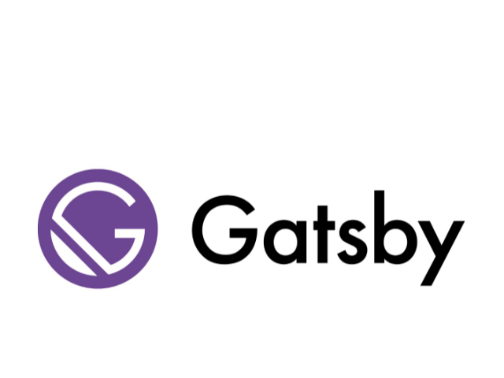

Sorry F. Scott Fitzgerald, but The Great Gatsby now belongs to the JavaScript framework. I'm a big fan of this framework and I've used it to create both this blog and my personal portfolio site. But what exactly is it?

Gatsby uses a powerful preconfigurator to build a website that uses only static files. It loads pages incredibly fast, it does server-side rendering, code splitting, data prefetching, image loading, asset optimization and more. All included out of the box. You code and develop, Gatsby transforms it.

Okay, but why use Gatsby over other frameworks? Well, the ecosystem is rich and has great docs, including a number of templates and start designs to get you started. The performance is blazing fast, in a way that will surprise you. Finally, it uses GraphQL for its data layer. Using that, you can collect your data from anywhere: JSON, CMS, APIs, whataver, and at build time Gatsby will create an internal GraphQL server and query all data from the same place, in the same way, for your react components.

### The Downsides

Yes, there are always downsides in life and this is no exception. While the framwork is great, it does require a knowledge of both React and GraphQL. But hey, if you haven't learned those yet, it's never too late to start.
