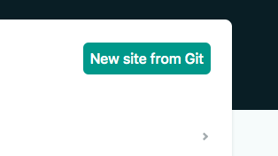
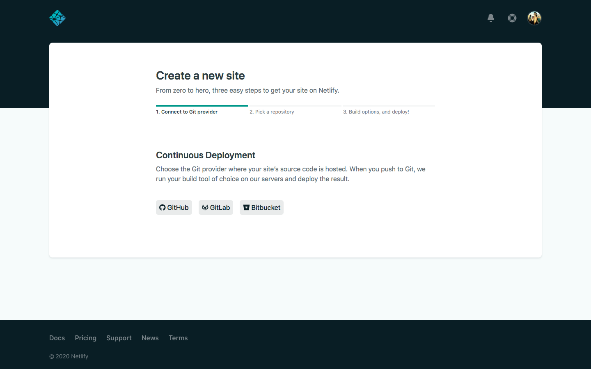
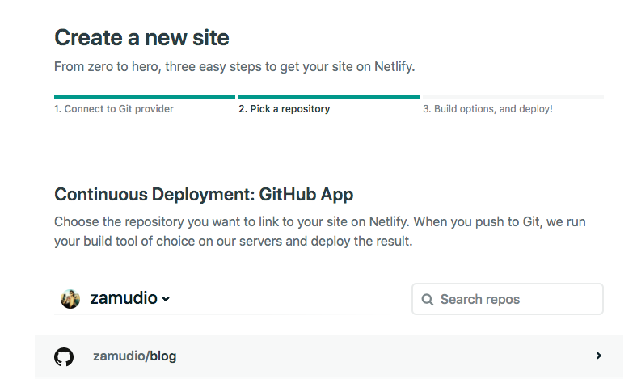
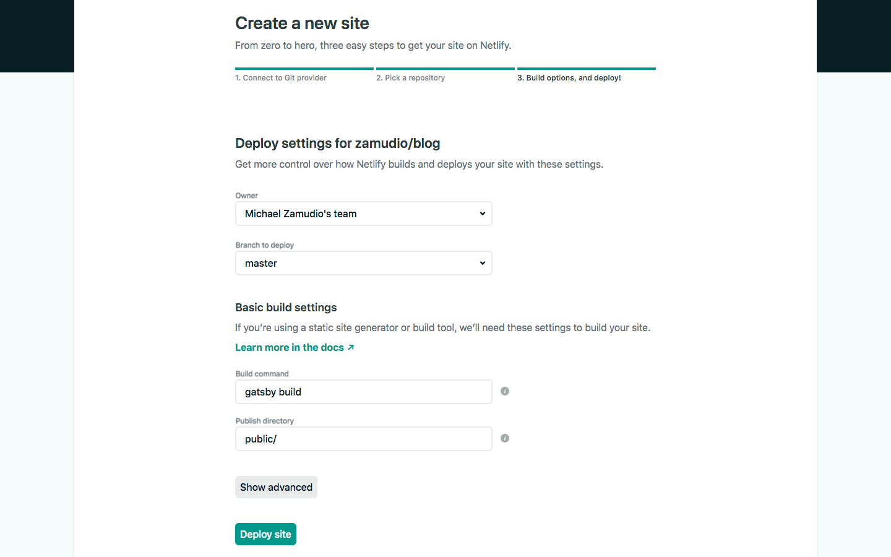

You finished a project, it's working great on your localhost and you can't wait to show people, but how do you get it online for people to see? One of the easiests ways I've found is to deploy with Netlify. Now, I've heard good things about Heroku, and GitHub Pages can be a pretty quick option, but what can I say, I'm a fan of Netlify.

### The Process

First you'll want to create a netlify account. Don't worry, it's completely free.

Once you're signed up and at the homepage, you want to look for a button in the upper right that say `New Site From Git`

After clicking on that, you'll be taken to a new screen where you connect your netlify account to whichever Git host you use. I use GitHub, so that's what I click on. However, if you use GitLab or BitBucket, then click on those.

After connecting to your Git host, you want to choose the repository that contains the project you want to deploy, like so:

Finally, you end up on the last page where you want to make sure the branch you're deploying is master and then you hit the button at the bottom that says `Deploy site`

Yes, it's that easy.
