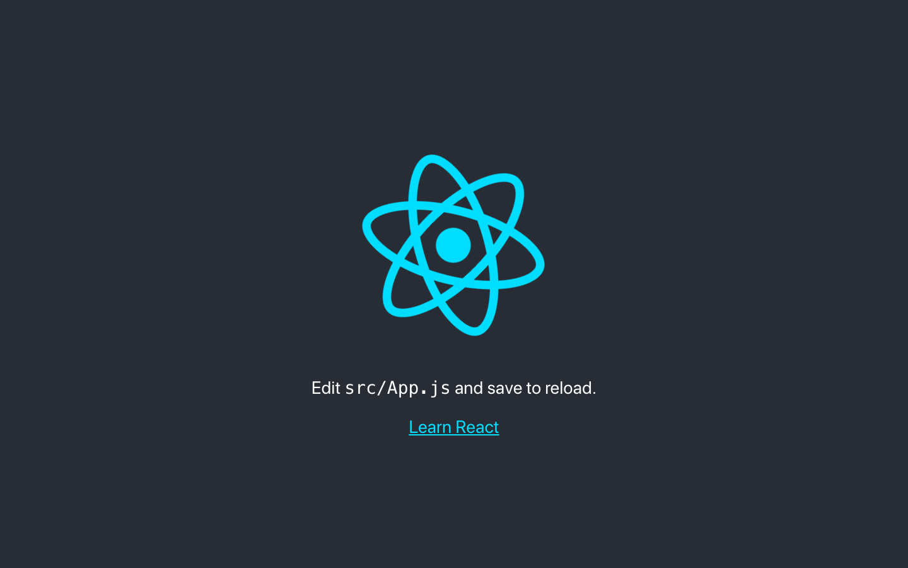
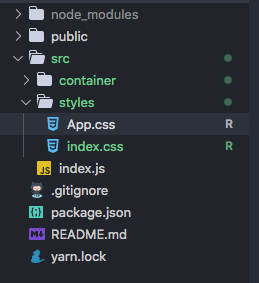
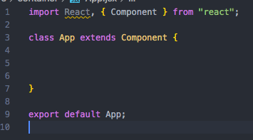
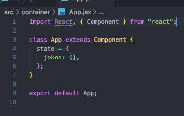
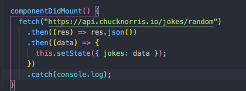
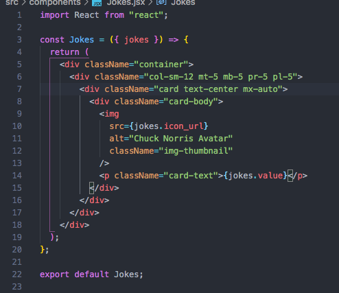
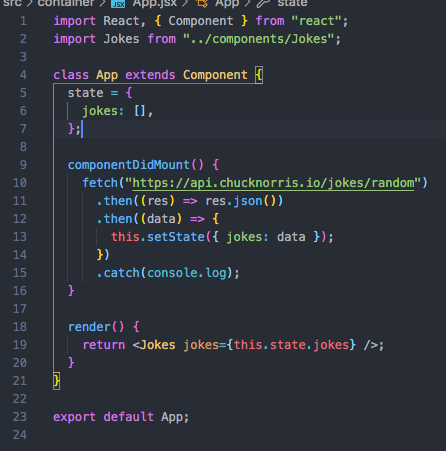
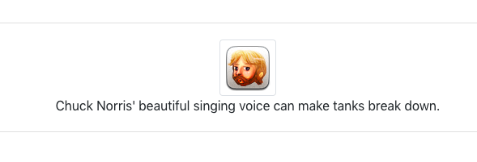

Let's face it: we are data addicted. But thankfully we can easily pull data from APIs that adhere to REST architectural style with the built-in fetch and json methods in React.

We'll create a small react app to show how to fetch API data (random Chuck Norris jokes, oh yeah) and display the info we want. As a note: this article assumes you understand React, RESTful APIs, and basic HTML/CSS.

Let's get started!

## First steps

This first thing we want to do is create a new react app. Open up your terminal and enter `npx create-react-app <your-app-name>`

Once it has finished installing the files, go ahead and change into the app directory you just made `cd <your-app-name>` and then type `yarn start`

Doing this will begin a dev server. Initially, because we used create-react-app, the page will be filled with a React logo and a link to the docs like so:

Go ahead and open up the app in your editor of choice. Personally I use vscode, but it doesn't really matter. Once open, let's delete some of the template stuff included in create-react-app. Delete the test files, logo.svg, the serviceworker file, and go ahead and structure the project.

I like to have a src/styles folder for all my scss, a src/container for my app.jsx file, and a src/components folder, while leaving src/index.jsx where it's at.

Now that we've done the initial steps, it's time to code!

## Fetching the data

Open up your App.jsx (or App.js, whichever you use) and completely empty it. Yep, just go ahead and make it blank. We want to import react and component, and then write a class.

By doing this, we can initialize it with a state. Because the API we're going to use is letting us get a random joke value, I'm going to initialize our state with a property named jokes and I want to set it to an empty array that will hold our API data. Let's do that next.

Next, we want to use the `ComponentDidMount()` method to place our API fetch in. Doing this will make sure that we fetch our data and then trigger a new render.

The way we want to call an API is with the fetch() method, the then() method, and reacts built-in JSON method. We first want to fetch our data from the url, then take that response and put it into the built-in JSON method, and then take that returned JSON data and set it to our state that we initialized.

The image hopefully clarifies that more. We are chaining .then() methods to grab the data, have it returned in a JSON format we can use, and set it to a state.

Now we need to render our data, but before we do this let's move on to step three where we build a component to create the view.

## Jokes component

We're going to use Bootstrap for our styling. To do so, let's add the latest Bootstrap CDN to our project. Head to public/index.html file and add this link:

`<link rel="stylesheet" href="https://stackpath.bootstrapcdn.com/bootstrap/4.5.0/css/bootstrap.min.css" integrity="sha384-9aIt2nRpC12Uk9gS9baDl411NQApFmC26EwAOH8WgZl5MYYxFfc+NcPb1dKGj7Sk" crossorigin="anonymous">`

After that go to your src/component folder create a new file called Jokes.jsx and inside that file import React. Let's create the view to return. We want to pass in the props we set in the App.jsx file, so

`const Jokes = ({ jokes }) => { return( ... ) }`

Now let's create a quick and dirty card display using bootstrap. Don't fear the DIVs, embrace them. Also, remember that in react it's className, camelCase like Js. Create a div with className container.

`

`

Inside that create a div with the className="col-sm-12 mt-5 mb-5 pr-5 pl-5"

`

`

Inside that create a div with the className="card"

`

`

Then inside that div, create another div with the class "card-body"

`

`

Inside the card body we are going to display two values from the API we fetched, the icon_url that returns a Chuck Norris avatar, and a value, which returns a joke. First let's display the avatar

``

Because we are using a value from the props we passed into this component, our src isn't in quotations and is instead in curly brackets. The jokes part is simply the name of the props and the icon_url is part of the API. Together jokes.icon_url will pass in that value, which in this case is a .png file

Underneath the img tag, let create a paragraph tag to display the joke text

`
{jokes.value}
`

Same as above, we are passing in our props jokes and attaching the .value to grab the joke.

If you're wondering where .value and .iconurl are coming from, it's specific to the API itself. Each API has a ton of Key:Value pairs related to the data they have. In this case value is simply the key name of the value that contains the joke, and icon_url is the key name that contains the .png file value to display the avatar img.

In total, your Jokes.jsx component should look like this:

Now that we have our component, we can finish up our render on our App.jsx file

## Finishing up

Head back to your App.jsx file. At the top import your joke component.

`import Jokes from '../components/Jokes'`

Since we have everything defined in our component, then our render is simply to return the Jokes component while passing it the properties grabbed from our API.

`return <Jokes jokes={this.state.jokes} />`

In all, your App.jsx file should look like this

Now if we go back to our dev server, we should see a card component that is displaying our random Chuck Norris joke.

How cool is that?! We fetched the joke from an API, as well as the avatar. We were able to parse it, use it in a component, build out a UI to display the joke.

