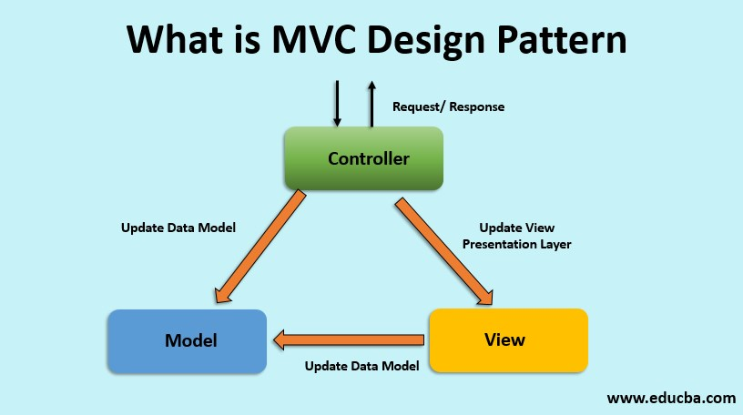
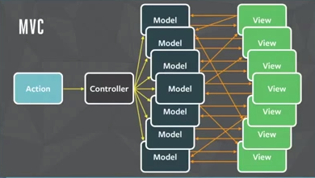

In web development the go-to design pattern for years has been the MVC pattern, however Facebook developed a way called Flux that promises to achieve the same with a different data approach. Let's compare:

### MVC

MVC stands for Model View Controller and was introduced in the 1970s. In MVC design, the main pattern is a separtion of concerns from each layer.

- The model manages the data of the application
- The view represents the UI display of the model
- The controller connects them, taking in inputs, manipulating the model, and updating the view

Because we separate the concerns for each layer, it provides benefits such as improved testability, but we quickly can reach limitations with this model when scaling. For example, most modern JS freamworks provide data binding support so that the view can talk with the model directly, and this can cause some heavy performance issues when you have many models talking to many views and having them update all the time.

This was a real problem for Facebook. Imagine your app having billions of people connected to it, all viewing things at the same time, making updates at the same time, etc. In MVC this creates the chaos you see below.

To solve this, Facebook developed a new way called flux.

### Flux

The main thing with flux is that it uses something called a unidirectional data flow. All this means is that data flows one way from an action to dispatcher to store to view. Let's dive in.

- Actions are objects with a type property and some data.
- Stores contain the app's state and logic, they can store anything almost
- Dispatcher is the central unit that processes the actions and invokes the callbacks. Caution though, this is not the same as the Controller
- Views are similar to what they are in MVC. They listen to the store for changes an re-render themselves as needed.

So how does this work?

Using the above image as a visual guide, when a user does something, the view creates an action. This action then creates new data and sends it to the dispatcher. The dispatcher then shares the action result with the store. The store updates the state and the view, which is listening to the store for updates, then updates itself to represent to most recent view state.

Simple. I guess.

